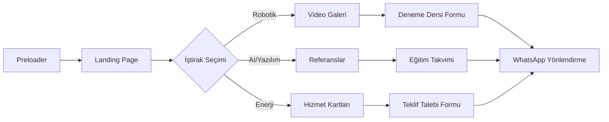

# Product Requirements Document (PRD) - Havsan Grup Kurumsal Web Projesi

**Versiyon:** 2.0  
**Tarih:** 28 Kasım 2025  
**Hazırlayan:** Senior Product Manager  
**Onay Durumu:** Draft  
**Proje Kodu:** HVSG-WEB-2025

---

## 📋 Executive Summary

Havsan Grup, Elazığ ve Ankara'da robotik kodlama eğitimi, yapay zeka/yazılım çözümleri ve enerji teknolojileri alanlarında faaliyet gösteren bir holding yapısıdır. Mevcut web varlığı parçalı, güncel olmayan ve mobil uyumsuz bir durumdadır. Bu proje, üç iştiraki (Robotik Kodlama, AI/Yazılım, Enerji) tek bir modern, headerless ve animasyon odaklı platformda birleştirerek hem B2C hem B2B müşterilere kesintisiz bir deneyim sunmayı amaçlamaktadır.

**Problem Statement:**
- Ebeveynler, çocukları için kaliteli robotik kodlama eğitimi bulma konusunda zorlanıyor (Elazığ bölgesi)
- Kurumsal müşteriler, Havsan'ın AI/yazılım/ISO danışmanlık yetkinliklerini keşfedemiyor
- Enerji sektörü müşterileri (GES yatırımcıları), teknik hizmet portföyünü ve termal drone teknolojisini göremiyor
- Mevcut web sitesi Google'da düşük ranking alıyor (SEO problemi)
- Kullanıcılar, farklı iş kolları için farklı sitelere gitmek zorunda (parçalı deneyim)

**Solution Overview:**
Google'ın Material You ve Google FX tasarım diline benzer, 3-kolon split screen yapısında, her iştirak için özel renklerle kodlanmış, **headerless** (üst menüsüz) bir Next.js 14 platformu. Video odaklı içerik, hızlı iletişim formları (WhatsApp entegrasyonu) ve Strapi CMS ile yönetilen dinamik yapı. Temper Group ([tempergroup.com.au](https://www.tempergroup.com.au/)) benzeri açılış animasyonu.

**Success Metrics:**
- İlk 3 ayda 5,000 unique visitor
- Robotik modülü "Ücretsiz Deneme Dersi" form doldurma oranı > %15
- AI modülü B2B teklif talebi: Aylık 10+ lead
- Enerji modülü GES bakım teklif talebi: Aylık 5+ lead
- Lighthouse Performance Score > 90
- Organik trafik %200 artış (6 ay içinde)
- Mobil kullanıcı oranı > %60

---

## 🎯 Proje Hedefleri (Objectives)

### Business Goals

1. **Lead Generation Artışı:**
   - **Robotik:** Aylık 50+ deneme dersi başvurusu (Elazığ Ataşehir lokasyonu)
   - **AI/Yazılım:** Aylık 10+ B2B danışmanlık/yazılım geliştirme talebi
   - **Enerji:** Aylık 5+ GES bakım/termal drone teklif talebi
   - **KPI:** Form submission rate, SQL (Sales Qualified Lead) sayısı, WhatsApp click-through rate
   - **Timeline:** Q1 2025 sonunda hedef

2. **Marka Bilinirliği:**
   - **Elazığ:** "robotik kodlama elazığ" araması için ilk 3 sırada
   - **Ankara:** "iso 42001 danışmanlık" araması için ilk 5 sırada
   - **LinkedIn:** 1,000+ takipçi (şu an [TBD - müşteri ile görüşülecek])
   - **KPI:** Branded search volume, social media engagement, video izlenme sayısı
   - **Timeline:** 6 ay

3. **Operasyonel Verimlilik:**
   - İçerik güncellemelerini teknik bilgi gerektirmeden yapabilme (Strapi CMS)
   - Müşteri sorularının %40'ını self-service ile çözme
   - **KPI:** CMS kullanım sıklığı, ortalama içerik güncelleme süresi
   - **Timeline:** 3 ay

### User Goals

1. **Ebeveynler:** 3 tık içinde Elazığ Ataşehir robotik kurs programını görüp ücretsiz deneme dersi randevusu alabilmeli
2. **Kurumsal Yöneticiler:** Referans çalışmaları, ISO/KVKK danışmanlık sürecini ve eğitim takvimini net anlayabilmeli
3. **Enerji Yatırımcıları:** Drone termal izleme hizmeti teknik detaylarını, GES bakım/onarım süreçlerini öğrenebilmeli

---

## 👥 Hedef Kitle (Target Audience & User Personas)

### Persona 1: "Teknoloji Meraklısı Ebeveyn - Ayşe"

- **Demografi:** 
  - Yaş: 35-45
  - Konum: Elazığ (şehir merkezi)
  - Gelir seviyesi: Orta-üst (aylık 20,000₺+)
  - Meslek: Öğretmen, mühendis, serbest meslek

- **Davranışlar:** 
  - Aktif sosyal medya kullanıcısı (Instagram, Facebook)
  - Çocuğunun eğitimine yatırım yapmaya istekli
  - Online araştırma yaparak karar veren
  - WhatsApp ile hızlı iletişim tercih eder

- **Pain Points:** 
  - Elazığ'da kaliteli robotik kodlama eğitimi veren kurum bulamama
  - Eğitim içeriği ve ücretlendirme hakkında net bilgi alamama
  - Çocuğunun ilgisini çekecek modern eğitim ortamı arayışı

- **Goals:** 
  - Çocuğuna 21. yüzyıl becerileri kazandırmak
  - Güvenilir, referansları olan bir eğitim kurumu bulmak
  - Uygun fiyatlı, kaliteli eğitim almak

- **Tech Savviness:** Orta-yüksek (smartphone, sosyal medya, online alışveriş)

### Persona 2: "Kurumsal Karar Verici - Mehmet Bey"

- **Demografi:** 
  - Yaş: 40-55
  - Konum: Ankara (Yenimahalle)
  - Gelir seviyesi: Yüksek
  - Meslek: Şirket sahibi, Genel Müdür, IT Müdürü

- **Davranışlar:** 
  - LinkedIn kullanıcısı
  - Referansları önemser, danışmanlık şirketlerini araştırır
  - Teknik dokümanlara (ISO standartları, eğitim içerikleri) dikkat eder
  - Google Workspace gibi kurumsal çözümlere yatırım yapar

- **Pain Points:** 
  - İş süreçlerini dijitalleştirme ihtiyacı
  - KVKK/ISO uyumluluk zorunluluğu, teknik destek eksikliği
  - Güvenilir yazılım/yapay zeka danışmanı bulamama
  - Paket çözümler yerine özelleştirilebilir hizmet arayışı

- **Goals:** 
  - İş süreçlerini otomatikleştirmek, verimliliği artırmak
  - Yasal uyumluluk (ISO 42001, ISO 27001, KVKK) sağlamak
  - Kurumsal yazılım/AI çözümleri ile rekabet avantajı elde etmek

- **Tech Savviness:** Yüksek (ERP sistemleri, kurumsal yazılım deneyimi)

### Persona 3: "GES Yatırımcısı - Hakan"

- **Demografi:** 
  - Yaş: 45-60
  - Konum: Türkiye geneli (özellikle güneş potansiyeli yüksek bölgeler)
  - Gelir seviyesi: Yüksek (GES yatırımcısı)
  - Meslek: Enerji sektörü yatırımcısı, tesis sahibi

- **Davranışlar:** 
  - Teknik raporları inceler
  - Verimlilik artırıcı teknolojilere açık
  - Bakım-onarım hizmetlerini düzenli takip eder
  - ROI (yatırım getirisi) odaklı

- **Pain Points:** 
  - GES verimlilik düşüşleri (kirlenme, arıza)
  - Arıza tespiti için manuel kontrol maliyeti
  - Hızlı müdahale edebilecek teknik ekip bulma zorluğu
  - Termal drone gibi modern teknolojilere erişim eksikliği

- **Goals:** 
  - GES verimlilik oranını maksimize etmek
  - Bakım-onarım maliyetlerini optimize etmek
  - Arızaları erken tespit edip üretim kaybını minimize etmek

- **Tech Savviness:** Orta (termal kamera, SCADA sistemleri hakkında bilgi sahibi)

---

## 🎨 Tasarım ve UX Gereksinimleri

### Design Principles

1. **Headerless Navigasyon:** 
   - Sayfa üstünde sabit menü **yok** (hamburger veya sticky header kullanılmayacak)
   - Tüm navigasyon, sayfa içi kartlar ve etkileşimli alanlarla sağlanacak
   - **Neden?** Modern, sürükleyici deneyim; kullanıcının dikkatini dağıtmayan temiz UI

2. **3 Tık Kuralı:** 
   - Kullanıcı, en derin içeriğe ana sayfadan maksimum 3 tıklama ile ulaşabilmeli
   - Her iştirak sayfasından form, referanslar, iletişim 1 tık mesafede

3. **Material You & Google FX İlkeleri:**
   - Dinamik renk paletleri (iştirak bazlı)
   - Smooth animasyonlar (Framer Motion)
   - Kart-tabanlı layout (hover efektleri ile derinlik)

4. **Accessibility (WCAG 2.1 AA):**
   - Renk kontrastı minimum 4.5:1
   - Klavye navigasyonu desteği
   - Alt text tüm görseller için zorunlu

### User Journey



### Visual Design

#### Renk Paleti

**Ana Renkler (Google Brand Colors):**
- 🔵 **Yaban Mersini (Blue):** `#4285F4`
- 🔴 **Zincifre (Red):** `#EA4335`
- 🟡 **Seçici Sarı (Yellow):** `#FBBC05`
- 🟢 **Deniz Yeşili (Green):** `#34A853`

**İştirak Özel Renkleri:**

**Robotik Kodlama Merkezi:**
- Teknoloji Mavisi: `#4285F4` (Primary)
- Platin Gümüş: `#E3E5E8` (Background)
- Devre Sarısı: `#FBBC05` (Accent - CTA buttons)
- Derin Uzay Laciverti: `#1A237E` (Text - Vurgu)

**Havsan AI & Yazılım:**
- Gradient: `#4E85EB` (Başlangıç) → `#D9666F` (Bitiş)
- Mor Vurgu: `#8875D6` (Secondary)
- **Kullanım:** Arka plan gradyanları, section ayırıcıları, hover efektleri

**Havsan Enerji:**
- Polisilikon (Sarı-Hardal): `#F3C242` (Primary)
- Külçe (Turuncu-Sarı): `#F99F1B` (Secondary)
- Gofret (Turuncu): `#E87D25`
- Hücre (Koyu Turuncu/Vermilyon): `#EE5F26`
- Modül (Gün Batımı Turuncusu): `#F15B24`
- Montaj (Turkuaz/Zümrüt Yeşili): `#00A786` (Accent - İletişim CTA)
- Güç Çevirici (Gök Mavisi/Cerulean): `#009CC9`

#### Typography

- **Font Ailesi:** 
  - Apple System Fonts (SF Pro) veya **Inter** / **Roboto**
  - **Neden?** Temiz, sans-serif, çok dilli destek, Google Fonts'ta ücretsiz
  
- **Heading:** 
  - H1: 48px (Desktop), 32px (Mobile), Bold
  - H2: 36px (Desktop), 24px (Mobile), Semi-bold
  - H3: 24px (Desktop), 18px (Mobile), Medium

- **Body:** 
  - 16px (Desktop/Mobile), Regular, line-height: 1.6

#### Spacing System

- **Grid:** 4px base unit
- **Padding/Margin:** 8px, 16px, 24px, 32px, 48px, 64px

#### Responsive Breakpoints

- **Mobile:** < 768px
- **Tablet:** 768px - 1023px
- **Desktop:** 1024px+
- **Large Desktop:** 1440px+

### Key UI Components

#### 1. Preloader (Giriş Animasyonu)

**Desktop:**
- "HAVSAN" metni ekranın üst-sol köşesinden gelir
- "Grup" metni ekranın alt-sağ köşesinden gelir
- Merkezde birleşme (0.8s smooth transition)
- Arka planda progress bar yerine, marka renklerinin ince bir animasyonu döner
- **Süre:** 2-3 saniye

**Mobile:**
- Aynı animasyon, daha kompakt

**Geçici İçerik:**
- Yükleme sırasında ekranın alt kısmında sosyal medya ikonları (WhatsApp, LinkedIn, Instagram) belirir
- Ana sahne yüklendiğinde fade-out (0.3s)

**Animasyon:** Framer Motion (spring physics)

**Referans:** [Temper Group](https://www.tempergroup.com.au/) açılış animasyonu

#### 2. Landing Page - Split Screen (3 Kolon)

**Desktop:**
- Ekran 3 eşit parçaya bölünür (%33 - %33 - %33)
- Her kolon: Robotik, AI, Enerji
- **Hover Efekti:**
  - Mouse ile kolon üzerine gelindiğinde → Kolon genişler (%33 → %50+)
  - Diğer 2 kolon daralır (%33 → %25 each)
  - Arka plan video/görsel canlanır (saturation artışı, scale 1.05x)
  - Çizgi animasyonlar (Google FX tarzı)
  - **Süre:** 0.4s cubic-bezier easing

**Mobile:**
- Kartlar alt alta dizilir (1/3 ekran yüksekliği each)
- "Above the fold" - kaydırma gerektirmeden 3 kart görünür
- **Referans:** [Sabancı Holding](https://www.sabanci.com/tr/) mobil giriş

**Tıklama:**
- Seçilen kolona tıklama → İlgili iştirak sayfasına smooth scroll veya sayfa geçişi (Framer Motion page transition)

**Görsel Stil:**
- Her kolon için özel background image/video:
  - **Robotik:** Çocukların robotik kodlama yaptığı görseller
  - **AI:** Yazılım ve yapay zeka eğitimini simgeleyen görseller
  - **Enerji:** GES (güneş enerjisi santrali) görselleri
- Gölgeli duruş (box-shadow: soft, depth)

**Referans:** [Google FX Labs](https://labs.google/fx)

#### 3. Robotik Kodlama Sayfası

**Bölümler:**

**a) Video Galeri (3-column grid):**
- YouTube Shorts embed
- **Hover-to-play:** Mouse üzerine gelince video preview oynar (muted, autoplay)
- **Videolar:**
  - [Video 1](https://www.youtube.com/shorts/OFbR8CATsVE)
  - [Video 2](https://www.youtube.com/shorts/4oRs3L9Gia4)
  - [Video 3](https://www.youtube.com/shorts/5wUXXJfoVOE)
- **Mobile:** 1-column stack

**b) "Ücretsiz 2 Saat Deneme Dersi" Formu:**
- **Tip:** Modal (overlay) veya inline section
- **Alanlar:**
  - Öğrenci Adı (Text input)
  - Öğrenci Soyadı (Text input)
  - Veli Telefonu (Tel input, masked format: +90 5XX XXX XX XX)
  - Öğrenci Yaşı (Number input, 6-16 yaş arası)
- **CTA Button:** "Ücretsiz Deneme Al" (Devre Sarısı: `#FBBC05`)
- **Validation:** React Hook Form + Zod schema
- **Submission:** POST `/api/form-submit` → Email to `bilgi@havsanrobotik.com.tr` + WhatsApp yönlendirme

**c) Lokasyon & İletişim:**
- **Konum:** Elazığ Ataşehir Akademi
- **Koordinatlar:** 38.656075, 39.167103
- **Harita:** Google Maps embed (lazy load)
- **Sosyal Medya:**
  - WhatsApp: [+90 534 785 59 57](https://wa.me/905347855957)
  - Instagram: [@havsan.robotik](https://www.instagram.com/havsan.robotik/)
  - YouTube: [@havsan.robotik](https://www.youtube.com/@havsan.robotik)

#### 4. Havsan AI & Yazılım Sayfası

**Bölümler:**

**a) Google Workspace Partner Section:**
- "Google Partner" badge (belirgin)
- Hizmetler: Kurulum, Eğitim, Danışmanlık
- **CTA:** "Teklif Al" button

**b) Kurumsal Yapay Zeka Eğitimi:**
- Eğitim dökümanları (indirilebilir PDF/Excel)
- Eğitim takvimi (Müsaitlik takvimi - canlı/güncel)
- Kazanımlar listesi
- **CTA:** "Eğitim Takvimini İndir" + "Teklif Al"

**c) Yazılım Geliştirme:**
- **Hizmetler:**
  - Mobil Uygulama (iOS, Android)
  - Web Uygulama Geliştirme
  - Kurumsal Özel Yazılım Projeleri
- **Özellik:** Kart-based layout, hover flip efekti

**d) ISO & KVKK Danışmanlığı:**
- **Hizmetler:**
  - ISO 42001 Yapay Zeka Yönetim Sistemi (Danışmanlık + Eğitim)
  - ISO 27001 Bilgi Güvenliği Yönetim Sistemi (Eğitim)
  - KVKK (Kişisel Verilerin Korunması Kanunu) Eğitimi
- **Sosyal Kanıt:** ISO sertifikalarının görselleri (carousel)

**e) Referanslar Bölümü (Kritik):**
- **Format:** Infinite scroll logo carousel (kayan görsel bandı)
- **Logolar:** Renkli, okunaklı, aynı boyut/hizada
- **Hover Efekt:** Logo grayscale → full color + scale 1.1x
- **Tıklama:** İlgili firmanın web sitesine yönlendirme
- **[TBD - Müşteri referans logoları temin edilecek]**

**f) Müşteri Yorumları:**
- **Format:** Testimonial cards (carousel)
- **[TBD - Müşteri görüşleri temin edilecek]**

**g) Lokasyon & İletişim:**
- **Konum:** Ankara/Yenimahalle
- **Koordinatlar:** 39°57'14.1"N 32°47'08.0"E
- **Harita:** Google Maps embed
- **Sosyal Medya:**
  - WhatsApp: [+90 534 785 59 57](https://wa.me/905347855957)
  - Instagram: [@havsan.yapayzeka](https://www.instagram.com/havsan.yapayzeka/)
  - YouTube: [@havsan.yapayzeka](https://www.youtube.com/@havsan.yapayzeka)
  - LinkedIn: [Atif Ertugrul Kan](https://tr.linkedin.com/in/atifertugrulkan)

#### 5. Havsan Enerji Sayfası

**Bölümler:**

**a) Hizmet Kartları:**
- **Kart 1: GES Bakım-Onarım-Takip-Taahhüt**
  - İkon: Solar panel (SVG)
  - Kısa açıklama
  - **CTA:** "Detaylı Bilgi"

- **Kart 2: Drone ile Termal İzleme**
  - İkon: Drone + termal kamera (SVG)
  - Açıklama: "Yapay zeka destekli arıza tespiti ve aksiyon planı oluşturma"
  - **CTA:** "Detaylı Bilgi"

- **Kart 3: Panel Temizliği**
  - İkon: Temizlik ekipmanı
  - **CTA:** "Detaylı Bilgi"

- **Kart 4: Güç Takibi ve Performans Analizi**
  - İkon: Grafik/Dashboard
  - **CTA:** "Detaylı Bilgi"

- **Kart 5: Depolamalı GES Danışmanlığı**
  - İkon: Batarya/Storage
  - **CTA:** "Detaylı Bilgi"

**b) Görsel Dil:**
- Teknik çizimler veya saha fotoğrafları
- **Overlay Efektleri:** Polisilikon Sarısı (`#F3C242`) ve Zümrüt Yeşili (`#00A786`) gradyanları
- **Animasyon:** Hover'da overlay opacity değişimi

**c) Teknoloji Vurgusu:**
- "Yapay Zeka Destekli Arıza Tespiti" section
- "Sahaya Özel Hızlı Arıza Tespiti" infographic

**d) Lokasyon & İletişim:**
- **[TBD - Enerji ofis lokasyonu temin edilecek]**
- **Sosyal Medya:**
  - WhatsApp: [+90 534 785 59 57](https://wa.me/905347855957)
  - Instagram: [@havsan.yapayzeka](https://www.instagram.com/havsan.yapayzeka/)
  - LinkedIn: [Ahmet Alptekin Kan](https://www.linkedin.com/in/ahmet-alptekin-kan-4a86a72a3/)
  - YouTube: [@havsan.yapayzeka](https://www.youtube.com/@havsan.yapayzeka)

---

## 🛠 Fonksiyonel Gereksinimler (Functional Requirements)

### Feature 1: Preloader & Landing Page

#### User Stories

- **US-001:** Kullanıcı olarak, siteye girdiğimde modern bir açılış animasyonu (Preloader) görebilmeliyim
  - **Acceptance Criteria:**
    - [ ] "HAVSAN" ve "Grup" metinleri farklı köşelerden gelip merkezde birleşir
    - [ ] Animasyon süresi 2-3 saniye
    - [ ] Sosyal medya ikonları geçici olarak görünür ve fade-out olur
    - [ ] LocalStorage ile tekrar ziyaretlerde atlama opsiyonu
    - [ ] Loading göstergesi kullanıcı deneyimini bozmaz

- **US-002:** Kullanıcı olarak, ana sayfada 3 iştirak arasından seçim yapabilmeliyim
  - **Acceptance Criteria:**
    - [ ] Desktop'ta 3 kolon yan yana görünür
    - [ ] Hover efekti çalışır (kolon genişleme, arka plan canlanma)
    - [ ] Mobile'da 3 kart alt alta "above the fold" görünür
    - [ ] Tıklama ile ilgili iştirak sayfasına smooth transition

#### Technical Specifications

- **Preloader:**
  - Component: `<Preloader />` (Framer Motion)
  - Animation timeline: `variants` ile orchestration
  - LocalStorage key: `havsanPreloaderShown`
  - Z-index: 9999 (en üstte)

- **Landing Page:**
  - Component: `<SplitScreenLanding />` (Framer Motion layout animations)
  - Hover effect: `layoutTransition` + CSS transforms (scale, saturate)
  - Responsive: Tailwind breakpoints (md:, lg:)

- **API Endpoints:** N/A (Static page)

#### Edge Cases & Error Handling

- Yavaş internet bağlantısında preloader timeout (5s max)
- JavaScript devre dışı ise → Fallback static page göster
- Eski tarayıcılar (IE11) → Grace degradation (animasyon yok, static görsel)

### Feature 2: Form Handling & Email Submission

#### User Stories

- **US-003:** Kullanıcı olarak, "Ücretsiz Deneme Dersi" formu doldurabilmeliyim
  - **Acceptance Criteria:**
    - [ ] Tüm alanlar required validation ile kontrol edilir
    - [ ] Telefon numarası +90 ile başlar, 10 haneli olmalı
    - [ ] Öğrenci yaşı 6-16 arası sayısal değer
    - [ ] Form submit sonrası success mesajı görünür
    - [ ] Email `bilgi@havsanrobotik.com.tr`'ye gönderilir
    - [ ] WhatsApp'a yönlendirme opsiyonu sunulur

- **US-004:** Kullanıcı olarak, form submit hatası durumunda net hata mesajı alabilmeliyim
  - **Acceptance Criteria:**
    - [ ] Network hatası → "Bağlantı hatası, lütfen tekrar deneyin"
    - [ ] Validation hatası → İlgili alan kırmızı highlight + hata metni
    - [ ] Retry butonu göster

#### Technical Specifications

- **Form Component:**
  ```typescript
  import { useForm } from 'react-hook-form';
  import { zodResolver } from '@hookform/resolvers/zod';
  import { z } from 'zod';

  const schema = z.object({
    studentName: z.string().min(2, 'En az 2 karakter'),
    studentSurname: z.string().min(2, 'En az 2 karakter'),
    parentPhone: z.string().regex(/^\+905\d{9}$/, 'Geçerli telefon: +905XXXXXXXXX'),
    studentAge: z.number().min(6).max(16, 'Yaş 6-16 arası olmalı'),
  });
  ```

- **API Endpoint:**
  - `POST /api/form-submit`
  - **Request Body:**
    ```json
    {
      "formType": "robotik_deneme",
      "data": {
        "studentName": "Ali",
        "studentSurname": "Yılmaz",
        "parentPhone": "+905551234567",
        "studentAge": 10
      }
    }
    ```
  - **Response:**
    ```json
    {
      "success": true,
      "message": "Form başarıyla gönderildi",
      "whatsappUrl": "https://wa.me/905347855957?text=Merhaba..."
    }
    ```

- **Email Service:**
  - Nodemailer (SMTP)
  - SMTP Config: [TBD - müşteri ile görüşülecek]
  - Email Template: HTML (responsive)

- **Spam Protection:**
  - Honeypot field (hidden input)
  - Rate limiting: 3 submission / 10 dakika per IP

#### Edge Cases & Error Handling

- Email servis down → Fallback: Form verisi Strapi'ye kaydedilir, manuel email gönderimi
- WhatsApp yönlendirme hatası → Toast notification: "WhatsApp açılamadı, lütfen manuel arayın"

### Feature 3: Video Galeri (Hover-to-Play)

#### User Stories

- **US-005:** Kullanıcı olarak, video kartlarına mouse ile geldiğimde preview oynatmalı
  - **Acceptance Criteria:**
    - [ ] Hover → Video autoplay (muted)
    - [ ] Hover out → Video pause, başa sar
    - [ ] Tıklama → YouTube Shorts sayfasında açılır
    - [ ] Lazy load (sadece viewport'ta olanlar yükle)
    - [ ] Mobile'da autoplay yok (data tasarrufu)

#### Technical Specifications

- **Component:** `<VideoCard />`
- **YouTube Embed:**
  ```html
  <iframe 
    src="https://www.youtube.com/embed/{VIDEO_ID}?autoplay=1&mute=1&controls=0&loop=1"
    loading="lazy"
  ></iframe>
  ```
- **Intersection Observer:** Viewport'a girince yükle
- **Mobile Behavior:** Tıklama ile YouTube app/web açılır

---

## 🔧 Teknik Gereksinimler (Technical Requirements)

### Tech Stack

#### Frontend

- **Framework:** **Next.js 14+ (App Router)**
  - **Neden?** 
    - Server-side rendering (SEO performansı)
    - File-based routing (kolay sayfa yönetimi)
    - Image optimization (next/image)
    - API routes (serverless functions)
    - React Server Components (RSC) desteği

- **Styling:** **Tailwind CSS v3.4+**
  - **Neden?** 
    - Utility-first (hızlı geliştirme)
    - Custom theme support (Google colors, spacing)
    - JIT compiler (bundle size optimize)
    - Responsive design kolaylığı

- **State Management:** **Zustand** (global state için minimal, form state için React Hook Form)
  
- **Animation:** **Framer Motion**
  - **Neden?** 
    - Declarative API (kolay öğrenim)
    - Layout animations (smooth transitions)
    - Spring physics (doğal hareketler)
    - Server Component desteği

- **Form Handling:** **React Hook Form + Zod**
  - **Neden?**
    - Type-safe validation
    - Performans (uncontrolled inputs)
    - Kolay hata yönetimi

- **Data Fetching:** **Native fetch + SWR** (client-side caching için)

- **SEO:** **next-seo** (meta tags, Open Graph, Twitter Cards)

#### Backend

- **CMS:** **Strapi v4 (Headless CMS)**
  - **Neden?** 
    - Flexible content types
    - REST/GraphQL API seçeneği
    - Media library (görseller, dökümanlar)
    - Admin panel (non-teknik kullanıcılar için)
    - Role-based access control (RBAC)

- **Database:** **PostgreSQL 15+**
  - **Neden?** 
    - Strapi ile uyumlu
    - JSONB field desteği (esnek veri yapıları)
    - Scalability
    - Production-ready

- **API Style:** **REST** (Strapi default)

- **Authentication:** **NextAuth.js** (admin panel için, müşteri için phase 2)

- **File Storage:** **Cloudinary** (images, videos) veya **AWS S3**

- **Email Service:** **Nodemailer** (SMTP) veya **SendGrid**

#### DevOps & Infrastructure

- **Hosting:** 
  - **Frontend:** Vercel (Next.js optimize, auto-deploy from Git)
  - **Backend:** Railway (Strapi + PostgreSQL) veya DigitalOcean App Platform

- **CI/CD:** **GitHub Actions**
  - Pipeline: Lint → Type-check → Build → Deploy
  - Preview deployments (PR branches)

- **Monitoring:** 
  - **Error Tracking:** Sentry
  - **Analytics:** Vercel Analytics + Google Analytics 4
  - **Performance:** Lighthouse CI (PR checks)

- **CDN:** **Cloudflare** (caching, DDoS protection)

### Performance Requirements

**Lighthouse Targets:**

| Metric | Target | Current (Baseline) |
|--------|--------|-------------------|
| Performance | > 90 | [TBD] |
| Accessibility | > 95 | [TBD] |
| Best Practices | > 90 | [TBD] |
| SEO | > 95 | [TBD] |

**Core Web Vitals:**

| Metric | Target | Açıklama |
|--------|--------|----------|
| **LCP** (Largest Contentful Paint) | < 2.5s | Ana görsel/içerik yükleme süresi |
| **FID** (First Input Delay) | < 100ms | İlk etkileşime yanıt süresi |
| **CLS** (Cumulative Layout Shift) | < 0.1 | Görsel kayma (layout stability) |

**Diğer Metrikler:**

- **Bundle Size:** 
  - Initial JS bundle < 200KB (gzipped)
  - CSS < 50KB (gzipped)
- **Image Optimization:** 
  - WebP format (fallback: JPEG/PNG)
  - Lazy loading (intersection observer)
  - `next/image` kullanımı (auto-optimization)
- **Font Loading:** 
  - Font-display: swap
  - Preload critical fonts

### Security Requirements

- **HTTPS:** Zorunlu (Vercel auto SSL)
- **CORS:** 
  - Frontend domain whitelist (Strapi config)
  - Credentials: include (cookie-based auth)
- **Rate Limiting:** 
  - API: 100 req/min per IP
  - Form submit: 3 req/10min per IP
- **Input Sanitization:** 
  - XSS prevention (DOMPurify for user-generated content)
  - SQL injection prevention (Strapi ORM - prepared statements)
- **CSRF:** Token validation (NextAuth.js)
- **GDPR/KVKK Uyumluluk:**
  - Cookie consent banner (first visit)
  - Data deletion request form (phase 2)
  - Privacy policy sayfası

### Browser & Device Support

**Desktop Browsers:**
- Chrome/Edge (son 2 versiyon)
- Firefox (son 2 versiyon)
- Safari (son 2 versiyon)

**Mobile:**
- iOS Safari 14+
- Chrome Android 90+

**Screen Sizes:**
- Mobile: 375px - 767px (iPhone SE, iPhone 12/13/14)
- Tablet: 768px - 1023px (iPad, Android tablet)
- Desktop: 1024px+ (MacBook, Windows laptop/desktop)
- Large Desktop: 1440px+ (iMac, external monitor)

---

## 📊 Non-Functional Requirements (NFRs)

### Scalability

- **Concurrent Users:** 10,000 simultaneous users (hedef: 3-5 yıl)
- **Database:** PostgreSQL connection pooling (PgBouncer)
- **CDN:** Cloudflare (static assets için global caching)

### Reliability

- **Uptime SLA:** 99.9% (aylık 43.8 dakika downtime max)
- **Automated Backup:** 
  - Database: Günlük, 30-day retention
  - Strapi media: Haftalık, 3-month retention

### Maintainability

- **Code Coverage:** > 80% (unit + integration tests)
- **TypeScript:** Strict mode (`strict: true` in tsconfig)
- **Linting:** ESLint + Prettier (pre-commit hooks via Husky)
- **Conventional Commits:** Git commit message standardı
- **Documentation:** 
  - README.md (setup instructions)
  - Component docs (Storybook - phase 2)

### Accessibility (A11y)

- **WCAG 2.1 Level AA Compliance:**
  - Tüm UI componentlerde ARIA labels
  - Keyboard navigation (Tab order, Enter/Space activation)
  - Screen reader compatibility (NVDA, JAWS test)
  - Color contrast ratio > 4.5:1 (normal text), > 3:1 (large text)
  - Skip links (ana içeriğe atla)
  - Form error announcements (aria-live regions)

---

## 🚫 Out of Scope (Phase 1'de OLMAYACAKLAR)

1. **Multi-language Support (TR/EN):** 
   - **Neden?** İlk aşamada sadece Türkçe hedef kitle
   - **Timeline:** Phase 2 (6 ay sonra değerlendirilecek)

2. **User Authentication & Dashboard:**
   - **Neden?** MVP için gerekli değil, admin panel yeterli
   - **Timeline:** Phase 2 (müşteri portal)

3. **E-commerce / Online Ödeme:**
   - **Neden?** Eğitim ödemeleri fiziksel ofiste yapılacak
   - **Timeline:** Phase 3 (12 ay sonra)

4. **Chatbot / Canlı Destek:**
   - **Neden?** WhatsApp hızlı iletişim için yeterli
   - **Timeline:** Phase 2 (AI chatbot entegrasyonu)

5. **Blog / Haber Sistemi:**
   - **Neden?** İçerik stratejisi henüz hazır değil
   - **Timeline:** Phase 2 (SEO için blog eklenebilir)

---

## 📅 Timeline & Milestones

### Phase 1: MVP (Minimum Viable Product)
**Süre:** 8 hafta

| Hafta | Milestone | Deliverables |
|-------|-----------|--------------|
| **1-2** | Proje Kurulumu & Design System | - Next.js + Strapi setup<br>- Tailwind config (Google colors)<br>- Typography system<br>- Component library başlangıç |
| **3-4** | Core Pages & API Integration | - Preloader + Landing page<br>- Robotik/AI/Enerji sayfaları (skeleton)<br>- Strapi content types<br>- Form API endpoints |
| **5-6** | UI Polish & Animations | - Framer Motion animasyonlar<br>- Responsive design (mobile/tablet)<br>- Video galeri (hover-to-play)<br>- Referanslar carousel |
| **7** | Testing & QA | - Unit tests (Jest + RTL)<br>- E2E tests (Playwright)<br>- Manual testing (cross-browser)<br>- Performance optimization |
| **8** | Deployment & Launch | - Production release (Vercel + Railway)<br>- DNS configuration<br>- Google Analytics setup<br>- Monitoring (Sentry) |

### Phase 2: Enhancements (Post-MVP)
**Süre:** 4 hafta
**Başlangıç:** 3 ay sonra (kullanıcı feedback'i toplandıktan sonra)

**Planlanan Özellikler:**
- Multi-language support (TR/EN)
- Blog/News section (Strapi blog content type)
- Customer testimonials management (admin panel)
- A/B testing (CTA button placements, color schemes)
- Advanced analytics (heatmap - Hotjar/Microsoft Clarity)

---

## 📈 Success Metrics & KPIs

### Launch Criteria (Phase 1 Tamamlama)

- [ ] Tüm P0 features tamamlandı
- [ ] Lighthouse score > 90 (tüm sayfalar)
- [ ] 0 critical bug (P0 severity)
- [ ] Cross-browser testing %100 tamamlandı
- [ ] Accessibility audit (WCAG AA) geçildi

### Post-Launch Metrics (İlk 30 Gün)

**Engagement:**

| Metric | Target | Ölçüm Aracı |
|--------|--------|-------------|
| Daily Active Users (DAU) | 150+ | Google Analytics 4 |
| Avg. Session Duration | > 3 dakika | GA4 |
| Pages per Session | > 2.5 | GA4 |
| Bounce Rate | < 50% | GA4 |

**Performance:**

| Metric | Target | Ölçüm Aracı |
|--------|--------|-------------|
| Page Load Time (p95) | < 3s | Vercel Analytics |
| Error Rate | < 0.5% | Sentry |
| API Response Time (p95) | < 500ms | Vercel Functions |

**Business:**

| Metric | Target | Ölçüm Aracı |
|--------|--------|-------------|
| Form Submission Rate | > 2% (ziyaretçilere oranla) | GA4 Events |
| WhatsApp Click-through Rate | > 10% | GA4 Events |
| Robotik Form Doldurma | 50+ / ay | Strapi Dashboard |
| AI Teklif Talebi | 10+ / ay | Strapi Dashboard |
| Enerji Teklif Talebi | 5+ / ay | Strapi Dashboard |

---

## 🤝 Stakeholders & Approvals

| Role | Name | Responsibility | Approval Status |
|------|------|----------------|-----------------|
| Product Owner | [TBD] | Final PRD approval, business decisions | ⏳ Pending |
| Tech Lead | [TBD] | Technical feasibility review, architecture | ⏳ Pending |
| Design Lead | [TBD] | Design system approval, UI/UX consistency | ⏳ Pending |
| Marketing Manager | [TBD] | Content strategy, SEO requirements | ⏳ Pending |
| Robotik Merkezi Müdürü | [TBD] | Robotik section content approval | ⏳ Pending |
| AI & Yazılım Müdürü | [TBD] | AI/Yazılım section content approval | ⏳ Pending |
| Enerji Müdürü | [TBD] | Enerji section content approval | ⏳ Pending |

---

## 📚 Appendices

### Appendix A: Glossary

- **LCP (Largest Contentful Paint):** Core Web Vital - ana içeriğin görünür olma süresi
- **FID (First Input Delay):** Core Web Vital - ilk kullanıcı etkileşimine yanıt süresi
- **CLS (Cumulative Layout Shift):** Core Web Vital - görsel kayma metriği
- **Headerless:** Üst menüsü olmayan tasarım yaklaşımı
- **Split Screen:** Ekranın bölümlere ayrıldığı layout
- **Material You:** Google'ın dinamik renk paletli tasarım dili
- **Preloader:** Site yüklenirken gösterilen açılış animasyonu
- **Hover-to-play:** Mouse üzerine gelince otomatik oynatılan video
- **Above the fold:** Sayfanın scroll olmadan görünen bölümü
- **CTA (Call-to-Action):** Kullanıcıyı aksiyona teşvik eden buton/link
- **SQL (Sales Qualified Lead):** Satış için uygun potansiyel müşteri

### Appendix B: References

**Design Inspiration:**
- [Temper Group](https://www.tempergroup.com.au/) - Preloader animasyonu
- [Google FX Labs](https://labs.google/fx) - Split screen layout, hover efektleri
- [Sabancı Holding](https://www.sabanci.com/tr/) - Mobil giriş sayfası

**Technical References:**
- [Next.js 14 Documentation](https://nextjs.org/docs)
- [Tailwind CSS](https://tailwindcss.com/)
- [Framer Motion](https://www.framer.com/motion/)
- [Strapi Documentation](https://docs.strapi.io/)

**Competitor Analysis:**
- [TBD - Rakip robotik kodlama merkezleri analizi]
- [TBD - Rakip AI/yazılım danışmanlık firmaları]
- [TBD - Rakip GES bakım firmaları]

### Appendix C: Change Log

| Date | Version | Changes | Author |
|------|---------|---------|--------|
| 2025-11-28 | 1.0 | Initial draft | PM Team |
| 2025-11-28 | 2.0 | Müşteri İsterleri dokümanı bazlı detaylandırma | PM Team |

---

## 📝 Notlar ve Aksiyonlar

### Müşteri ile Görüşülecek Konular (TBD Items):

1. **Referans Logoları:** Hangi şirketlerle çalışıldı? Logolar temin edilecek
2. **Müşteri Yorumları:** Testimonial'lar için 3-5 müşteri feedback'i
3. **SMTP Bilgileri:** Email servisi için SMTP credentials
4. **ISO Sertifikaları:** Görsel dosyalar (yüksek çözünürlük)
5. **Eğitim Dökümanları:** PDF/Excel formatında eğitim materyalleri
6. **Eğitim Takvimi:** Müsaitlik bilgileri (API entegrasyonu veya manuel update?)
7. **Enerji Ofis Lokasyonu:** Konum bilgisi, harita koordinatları
8. **Mevcut Analytics:** Var olan web sitesi analytics verisi (baseline için)
9. **Budget & Resources:** Proje bütçesi, hosting tercihi (AWS/DigitalOcean/Railway)
10. **Launch Date:** Hedeflenen go-live tarihi

### Teknik Kararlar Gerekiyor:

- [ ] Strapi hosting: Railway vs DigitalOcean (maliyet karşılaştırması)
- [ ] Email service: Nodemailer (self-hosted SMTP) vs SendGrid (cloud)
- [ ] Image storage: Cloudinary (free tier yeterli mi?) vs AWS S3
- [ ] Google Maps API key: Ücretli plan gerekli mi? (aylık kullanım tahmini)

---

**Son Güncelleme:** 28 Kasım 2025  
**Doküman Sahibi:** Product Management Team  
**İletişim:** [TBD - proje yöneticisi email]
